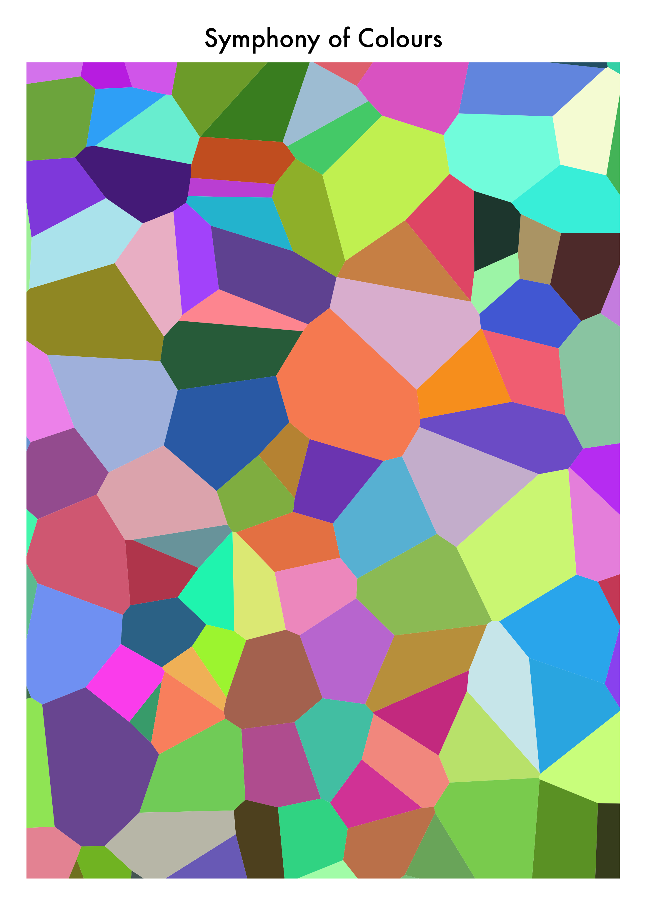
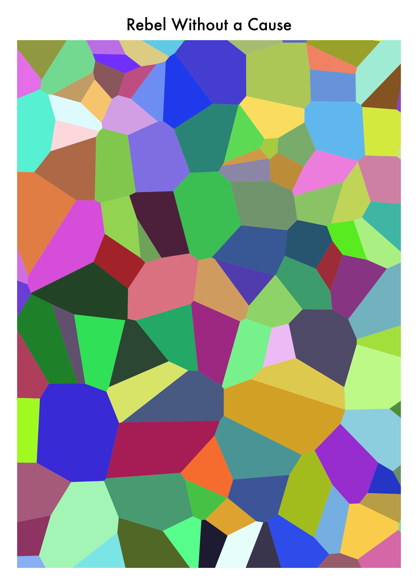
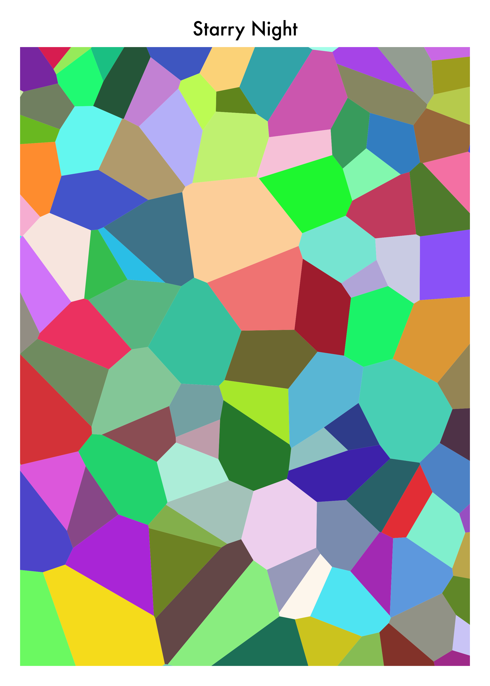

# Serendipi-art? Really?
'Serendipi-art' originated from a lack of creative juice and is short for 'serendipitious art'. Serendipi-art determinstically generates a [Voronoi](https://en.wikipedia.org/wiki/Voronoi_diagram) image with a random caption by providing it with a seed value. The image is captioned using OpenAI's GPT-3 [davinci-instruct-beta-v3](https://beta.openai.com/docs/engines/instruct-series-beta) model, with the caption randomly generated by giving the model the following prompt:

>This is an image name generator
>
>1. Colourful Shapes
>2. Light All Over
>3. Voronoi Masterpiece
>4. Lucid Dreams
>5. Naughty by Nature
>6. Bad and Beyond
>7. Rainbow Rain
>8.
As seen above, point 8 is left intentionally blank as that point will be autocompleted by OpenAI. Pretty cool.
<br>
We give OpenAI some examples of image names and it's able to complete our list with a name that could possibly fit in our list. For example, an OpenAI response could look like:
>8. **Ominous Fog**

# Examples
| Seed = 220492 | Seed = 100 | Seed = 200495 |
|     :---:         |     :---:      |     :---:     |
|  |     |  |

# Usage
## Clone the project
```bash
$ git clone https://github.com/tobiade/serendipi-art.git
```

## Install dependencies
```bash
$ cd serendipi-art # go into the serendipi-art folder
$ pip install -r requirements.txt # install dependencies
```

## Set environment variables
Firstly, you'll need to get an API key from [OpenAI](https://openai.com/api/) to utilise the OpenAI model. You can do this by creating an account and grabbing your API key from [here.](https://beta.openai.com/account/api-keys)
<br>

You can then set environment variables by creating a `.env` file (a file named `.env`) in the serendipi-art directory like so:
```bash
# Flask
FLASK_APP=serendipiart
FLASK_ENV=development

# OpenAI
OPENAI_API_KEY={Insert your API key}
```
or you could set them in your shell like so:
```bash
$ export FLASK_APP=serendipiart
$ export FLASK_ENV=development
$ export OPENAI_API_KEY={Insert your API key}
```

## Run the application
```bash
$ flask run
```

## View your masterpiece
Visit http://127.0.0.1:5000/art/{seed value} e.g http://127.0.0.1:5000/art/111023. A different number will generate a different Voronoi image.

## Credits
- [Generative Art with Python](https://www.generativehut.com/post/robots-and-generative-art-and-python-oh-my)
